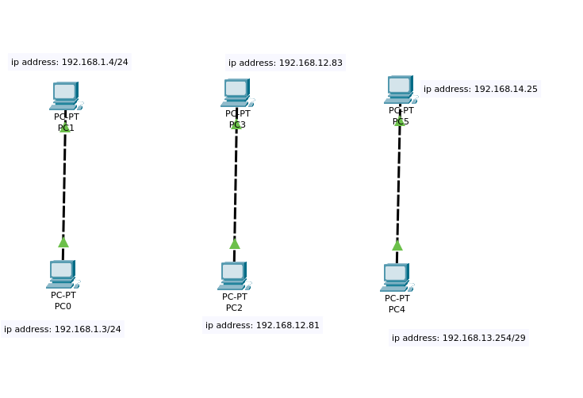
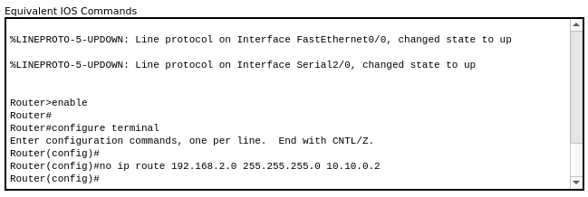

# Exercise 1




Three pairs of direct (point-to-point) connections are presented, each with unique subnets. 
- the connection between **PC2** and **PC3** is established using an **RJ-45** crossover cable
- **Crossover cable:** In contrast, a crossover cable has one end with the transmit and receive pairs reversed. It's used for direct connections between similar devices, such as connecting two computers or two switches/router without an intermediate device.
Let's examine the connection **PC2 => PC3**:

```
PC2:
IP address: 192.168.12.83
Subnet mask: 255.255.255.248
```

```
PC3:
IP address: 192.168.12.81
Subnet mask: 255.255.255.248
```


# Exercise 2


Here are two network setups:

- **Switch** with 5 PCs <br>
- **Hub** with 5 PCs <br>

All IP addresses are configured statically within the same subnet (255.255.255.248).


Below is a comparison table of switches and hubs:
<table border="1">
  <tr>
    <th>Feature</th>
    <th>Switch</th>
    <th>Hub</th>
  </tr>
  <tr>
    <td>Functionality</td>
    <td>Operates at OSI Layer 2 (Data Link Layer)</td>
    <td>Operates at OSI Layer 1 (Physical Layer)</td>
  </tr>
  <tr>
    <td>Traffic Handling</td>
    <td>Uses MAC addresses to forward data only to the intended device</td>
    <td>Broadcasts data to all connected devices</td>
  </tr>
  <tr>
    <td>Performance</td>
    <td>Better performance in terms of speed and efficiency</td>
    <td>Slower performance due to shared bandwidth</td>
  </tr>
  <tr>
    <td>Cost</td>
    <td>Generally more expensive</td>
    <td>Relatively cheaper</td>
  </tr>
</table>


## What is OSI?

The **open systems interconnection (OSI)** model is a conceptual model created by the International Organization for Standardization which enables diverse communication systems to communicate using standard protocols. In plain English, the OSI provides a standard for different computer systems to be able to communicate with each other.
<br>


# Exercise 3


I have configured a server rack containing four servers dedicated to different services:

- **HTTPS (Secure Hypertext Transfer Protocol):** Handles secure communication over the web.
- **FTP (File Transfer Protocol):** Manages file transfers between clients and servers.
- **DNS (Domain Name System):** Resolves domain names to IP addresses.
- **DHCP (Dynamic Host Configuration Protocol):** Automatically assigns IP addresses to devices on the network. <br>

###### These servers are interconnected through a switch. Additionally, there are six PCs connected to the same switch, obtaining their IP addresses dynamically from the DHCP server.

### Identify the port and OSI model layer for each protocol used:


- **HTTPS**: Port 443 (TCP), OSI Layer 7 (Application Layer)
- **FTP**: Port 20 (TCP) for data transfer, Port 21 (TCP) for control, OSI Layer 7 (Application Layer)
- **DNS**: Port 53 (TCP and UDP), OSI Layer 7 (Application Layer)

###  DNS Mapping


```
deep-in-net.local > 192.168.1.99
deep-in-net.com > deep-in-net.local
```

###### 192.168.1.99 is HTTPS Server IP


<br>
- **CNAME (Canonical Name):** Used in DNS to create aliases for domain names. Allows mapping multiple domain names to a single primary domain. Example: "www.example.com" can point to "example.com".
- **A Record (Address Record):** Fundamental DNS records mapping domain names to IP addresses. Converts human-readable domain names (like example.com) to numerical IP addresses (such as 192.168.1.1) used by computers on the Internet.

### Into Browser


### Accessing to FTP server


# Exercise 4


```
PC0:
IP address: 192.168.1.2
Subnet mask: 255.255.255.252
```

```
PC1:
IP address: 192.168.2.2
Subnet mask: 255.255.255.252
```

###### Basically, there is a router here with two connections, each leading to a PC. The connections are set up to enable communication between the PCs.


### Knowledge

1. A router is a networking device that connects different networks together and routes network traffic between them. Its primary role is to determine the best path for data packets to travel from one network to another based on IP addresses. Routers operate at the network layer (Layer 3) of the OSI model.


 2. Difference between Switch and Router
1. [x] **Switch**: Operates at the data link layer (Layer 2) of the OSI model. It connects devices within the same network and forwards data based on MAC addresses. Switches are used to create local area networks (LANs) where multiple devices can communicate efficiently.
2. [x] **Router**: Operates at the network layer (Layer 3) of the OSI model. It connects multiple networks together (such as LANs or the Internet) and forwards data packets between them based on IP addresses. Routers enable communication between devices across different networks.

3. A router operates at the network layer (Layer 3) of the OSI model. It uses IP addresses to determine the best path for forwarding data packets between different networks.
4. The default gateway is a specific router on a network that serves as the entry and exit point for traffic destined for destinations outside the local network. It is typically configured on devices (such as computers or other networked devices) to route traffic to networks beyond their immediate local network. When a device needs to communicate with a device on another network, it sends the data packets to the default gateway, which then forwards them to the appropriate destination.


# Exercise 5


###### Basically, the same concept as in exercise 4, but 
The setup involves two switches, each operating within its own subnet:

- Devices connected to the same switch can communicate with each other.
- Devices in subnet 1 are able to communicate bidirectionally with devices in subnet 2, facilitated by the router ensuring connectivity between the subnets.
- Devices in subnet 2 are able to communicate bidirectionally with devices in subnet 1

# Exercise 6


This image depicts a simple network architecture with the following components:

Two routers:

- Router-PT Router1 (IP: 192.168.1.1)
- Router-PT Router2 (IP: 192.168.2.1)

Two PCs:
- PC-PT PC0 (IP: 192.168.1.2)
- PC-PT PC1 (IP: 192.168.2.5)


Network connections:

- The routers are connected to each other via a red line, representing a WAN link. Their interface IPs for this connection are 10.10.0.1 (Router1) and 10.10.0.2 (Router2).
- Each PC is connected to its respective router via LAN connection.

This setup is a basic internetwork where two separate local area networks (LANs) are connected via a wide area network (WAN) link between the routers. This allows devices on one LAN to communicate with devices on the other LAN through the routers.
The architecture enables:


###### This type of setup is common in scenarios where you need to connect two geographically separated networks, such as branch offices of a company.


Static Router <br>




# Exercise 7


Two routers:
- Router-PT Router1 (IP: 192.168.1.1)
- Router-PT Router2 (IP: 192.168.2.1)


Two switch:

- Switch0 (connected to Router1)
- Switch1 (connected to Router2)


Multiple end devices:

- Left side (connected to Switch0): 5 PCs (PC1 to PC5)
- Right side (connected to Switch1): 3 PCs (PC6, PC7, PC8) and 1 Laptop


Network connections:

- The routers are connected via a red line (WAN link) with IPs 10.10.0.1 and 10.10.0.2
- Router1 is directly connected to a hub or switch (not explicitly shown) that connects to 5 PCs
- Router2 is connected to Switch1, which in turn connects to 3 PCs and 1 Laptop

### Arcitecture

1. Two separate networks connected via routers (similar to the previous example)
2. Hierarchical topology with a switch connecting multiple devices to Router2
3. Scalability: The switch on the right allows for easy addition of more devices to that network segment
4. Segmentation: The two routers create separate network segments (192.168.1.x and 192.168.2.x), allowing for better network management and security
5. Inter-network communication: Devices on either side can communicate with each other through the routers

###### This setup is typical for small to medium-sized organizations where you have different departments or locations connected via a WAN link, with each location having its own local network structure.
# Exercise 8


### Components

1. Routers:

- Router1 (IP: 10.10.0.1/30)
- Router2 (central router, connecting all segments)
- Router3 (IP: 10.10.1.2/30)


2. Switches:

- Switch1 (connected to Router1)
- Switch2 (connected to Router2)
- Switch3 (connected to Router3)


3. Network segments:

- Network 192.168.1.198/26 (connected to Switch1)
- Network 192.168.2.1/24 (connected to Switch2)
- Network 192.168.3.164/28 (connected to Switch3)


4. End devices:

- PCs (PC0 to PC10)
- One laptop (Laptop0)


5. Connections:

- Routers are interconnected with red lines, representing WAN links
- Switches connect to routers and end devices with LAN connections

### Arcitecture

1. Network segmentation: Three distinct network segments, each with its own subnet
2. Hierarchical design: Core (Router2), distribution (Router1 and Router3), and access (switches) layers
3. Scalability: Each segment can accommodate multiple devices
4. Inter-network routing: Devices in different segments can communicate via the routers
5. Subnetting: Different subnet masks are used for different network segments

###### This setup is suitable for medium to large organizations with multiple departments or locations. It allows for efficient network management, traffic isolation, and security implementation.


###### The use of different subnet sizes (/26, /24, /28) suggests tailored address space allocation based on the needs of each segment.